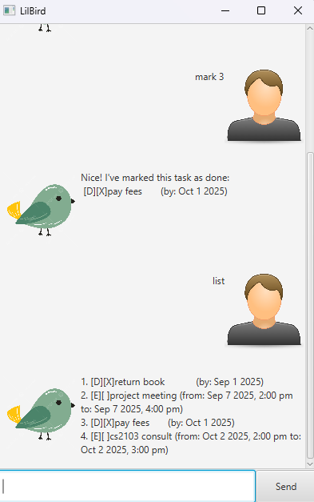

# LilBird — User Guide 🐦

> “Your mind is for having ideas, not holding them.” — David Allen

LilBird is a friendly, lightweight task bot. Type simple commands to add todos, deadlines, events, tag items, and more — all from a clean JavaFX GUI.



---

## Table of Contents
- Quick Start
- How It Works
- Features
    - List
    - Todo
    - Deadline
    - Event
    - Mark / Unmark
    - Delete
    - Find
    - Labels
    - Exit
- Command Summary
- Saving & Data File
- FAQ / Troubleshooting

---

## Quick Start

1. **Requirements**
    - **Java 17** (JDK 17)
    - Gradle wrapper included

2. **Run directly (recommended)**
   ```bash
   ./gradlew run
3. **Run as JAR**
```java -jar LilBird.jar```

Start typing commands in the input box and press Enter (or click Send).
---
## How It Works

- Tasks are saved locally in `data/lilbird.txt` and auto-saved after changes.
- Indexes are 1-based in all commands (e.g., `mark 1` marks the first item).
- Dates use ISO formats for reliability.

### At a glance:
- Todos
- Deadlines (date or date+time)
- Events (start & end)
- Labels (tags)
- Find by keyword
- Mark / Unmark / Delete
- Persistent storage
- Legacy text-UI tests (use GUI + unit tests instead)

## Features
### List
Shows all tasks.

Syntax: 
```list```
### Todo
Adds a simple task with no date.

Syntax:
```todo <description>```

Example:
```todo Read "Clean Code"```


### Deadline
Adds a task due on a date or a date+time.

Syntax:
```deadline <description> /by <yyyy-MM-dd[ HHmm]>```

- Date-only: `yyyy-MM-dd`
- Date+time: `yyyy-MM-dd HHmm` (24h, e.g., `1830`)

Examples:

- ```deadline CS2103T iP v1 /by 2025-09-30```

- ```deadline Pay tuition /by 2025-09-30 1830```


### Event
Adds an event spanning a start and end time.

Syntax:
```event <description> /from <yyyy-MM-dd HHmm> /to <yyyy-MM-dd HHmm>```

Example:
```event Team sync /from 2025-09-20 1000 /to 2025-09-20 1200```

### Mark / Unmark
Marks a task as done or not done.

Examples:
```mark 2```
```unmark 2```


### Delete
Removes a task.

Example:
```delete 3```


### Find
Shows tasks whose description contains `<keyword>` (case-insensitive substring).

Examples:
```find book```
```find cs2103t```


### Labels
Attach or remove tags to help you categorize. Tags are normalized (e.g., Fun → fun).

Syntax:
- ```label <index> <tag...>```
- ```unlabel <index> <tag...>```

Examples:
- ```label 1 school urgent```
- ```label 3 cs2103t ip```
- ```unlabel 3 ip```

### Exit
Closes the app.

Example:
```bye```


## Command Summary

- `list` — Show all tasks
- `todo <description>` — Add a todo
- `deadline <description> /by <yyyy-MM-dd[ HHmm]>` — Add a deadline
- `event <description> /from <yyyy-MM-dd HHmm> /to <yyyy-MM-dd HHmm>` — Add an event
- `mark <index>` — Mark as done
- `unmark <index>` — Mark as not done
- `delete <index>` — Delete a task
- `find <keyword>` — Search tasks (case-insensitive)
- `label <index> <tag...>` — Add tags
- `unlabel <index> <tag...>` — Remove tags
- `bye` — Exit

## Saving & Data File

- Tasks are persisted in `data/lilbird.txt`.
- Changes are auto-saved after each command.

## FAQ / Troubleshooting

- Ensure Java 17 is installed and on your PATH.
- If the app cannot save, check write permissions for the `data/` folder.

---


